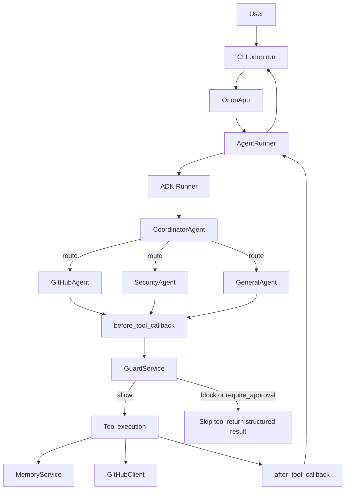
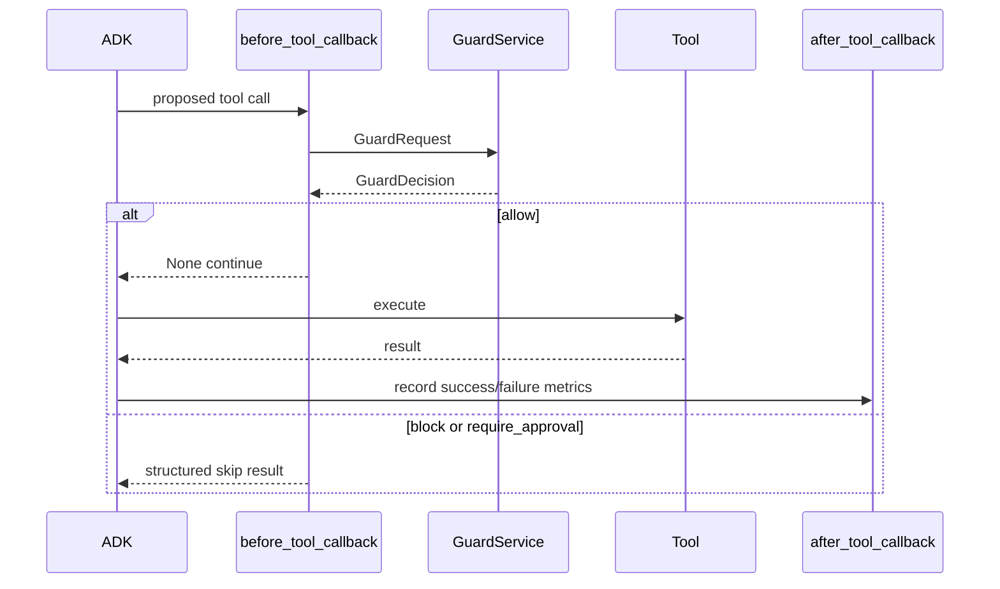

# Architecture

Orion is a multi-agent platform composed of shared services around Google ADK.

This page describes the **implemented** v1.0 architecture — including ownership
and persistence boundaries that matter for operators and contributors.

## Platform map

```text
CLI (orion)
  └── OrionApp
        ├── SessionManager          (in-memory Orion session metadata)
        ├── ADKSessionAdapter       (ADK InMemorySessionService)
        └── AgentRunner
              └── ADK App / Runner  (coordinator agent root)

Shared process services (ApplicationContainer)
  ├── Trace + TraceService
  ├── MetricsRegistry + MetricsService
  ├── GuardService + policies
  ├── SQLiteMemory
  └── MemoryService + memory policies
```

## Composition root

Services are built in `src/container/application_container.py` and exposed as a
module-level `container` from `src/container/__init__.py`.

Order of construction:

1. Trace + exporters + `TraceService`
2. Metrics registry + `MetricsService`
3. Guard policies + `GuardService`
4. SQLite persistent memory
5. Memory policy engine + `MemoryService`

Callbacks and memory tools import this shared container. Multiple `OrionApp`
instances in one process therefore share Guard, memory, traces, and metrics.

## Request flow



## Guarded tool pipeline



## Persistence model

| Concern | Durable? | Backend |
| --- | --- | --- |
| Preferences / persistent keys | Yes | SQLite |
| ADK session / tool state | No | In-memory |
| Orion `SessionInfo` metadata | No | In-memory |
| Traces | No | In-process list |
| Metrics | No | In-process registry |
| Artifacts / ADK memory service | No | In-memory |

## Error model

External and subsystem failures are wrapped into the `OrionError` hierarchy so
callers see Orion types (`GitHubIntegrationError`, `MemoryOperationError`,
`GuardEvaluationError`, `OrionRuntimeError`, …) instead of raw third-party
exceptions. See [Errors](../reference/errors.md).

## Design principles

1. **Honest surfaces** — CLI commands exist only when they can produce real output.
2. **Shared safety boundary** — every tool call hits Guard before execution.
3. **Typed contracts** — config, decisions, metrics snapshots, and errors are structured.
4. **Secrets stay secret** — redacted in repr, CLI, and error messages.
5. **Extend at seams** — policies, storage, exporters, agents (no formal plugin loader yet).

## Limitations (document deliberately)

- Global container / GitHub client wiring (not fully per-app isolation)
- No durable conversations, metrics store, or trace store
- Approval is classification-only (no human resume workflow)
- GitHub tools are read-only
- Role permission policy is largely inactive on the default callback path

## Related docs

- [Agent runtime](agent-runtime.md)
- [Guard & approvals](guard-and-approvals.md)
- [Memory model](memory-model.md)
- [Observability](observability.md)
- [Extending Orion](../development/extending-orion.md)
